---
## Front matter
title: "Отчет по лабораторной работе №3"
subtitle: "Язык разметки Markdown"
author: "Перфилов Александр Константинович | группа: НПИбд 02-23"

## Generic otions
lang: ru-RU
toc-title: "Содержание"

## Bibliography
bibliography: bib/cite.bib
csl: pandoc/csl/gost-r-7-0-5-2008-numeric.csl

## Pdf output format
toc: true # Table of contents
toc-depth: 2
lof: true # List of figures
lot: true # List of tables
fontsize: 12pt
linestretch: 1.5
papersize: a4
documentclass: scrreprt
## I18n polyglossia
polyglossia-lang:
  name: russian
  options:
	- spelling=modern
	- babelshorthands=true
polyglossia-otherlangs:
  name: english
## I18n babel
babel-lang: russian
babel-otherlangs: english
## Fonts
mainfont: PT Serif
romanfont: PT Serif
sansfont: PT Sans
monofont: PT Mono
mainfontoptions: Ligatures=TeX
romanfontoptions: Ligatures=TeX
sansfontoptions: Ligatures=TeX,Scale=MatchLowercase
monofontoptions: Scale=MatchLowercase,Scale=0.9
## Biblatex
biblatex: true
biblio-style: "gost-numeric"
biblatexoptions:
  - parentracker=true
  - backend=biber
  - hyperref=auto
  - language=auto
  - autolang=other*
  - citestyle=gost-numeric
## Pandoc-crossref LaTeX customization
figureTitle: "Рис."
tableTitle: "Таблица"
listingTitle: "Листинг"
lofTitle: "Список иллюстраций"
lotTitle: "Список таблиц"
lolTitle: "Листинги"
## Misc options
indent: true
header-includes:
  - \usepackage{indentfirst}
  - \usepackage{float} # keep figures where there are in the text
  - \floatplacement{figure}{H} # keep figures where there are in the text
---

# Цель работы

Целью работы является освоение процедуры оформления отчетов с помощью легковесного языка разметки Markdown.

# Ход лабораторной работы

Откроем терминал. Перейдём в каталог курса сформированный при выполнении лабораторной работы №2.

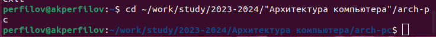{width=100%}
 
Обновим локальный репозиторий, скачав изменения из удаленного репозитория.

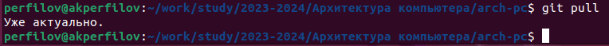{width=100%}

Перейдём в каталог с шаблоном отчета по лабораторной работе № 3.

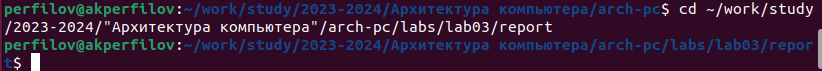{width=100%}

Проведём компиляцию шаблона с использованием Makefile.

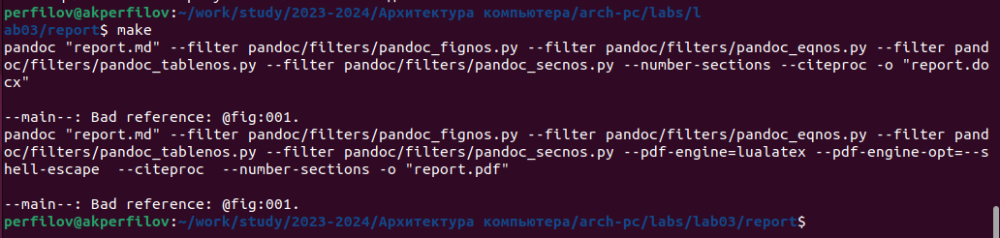{width=100%}

При успешной компиляции должны сгенерироваться файлы report.pdf и report.docx.
Откроем и проверим корректность полученных файлов.

{width=100%}

Удалим полученные файлы с использованием Makefile. Проверим, что после этой команды файлы report.pdf и report.docx были удалены.

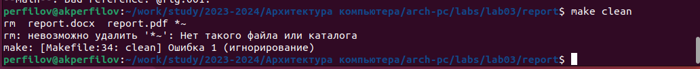{width=100%}

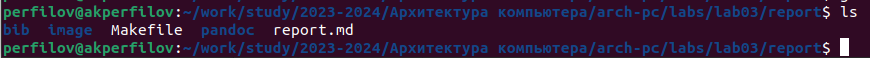{width=100%}

Откроем файл report.md c помощью любого текстового редактора, например gedit.

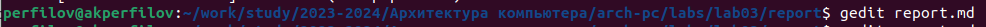{width=100%}

Внимательно изучим структуру этого файла.

Заполним отчет и скомпилируем отчет с использованием Makefile. Проверим корректность полученных файлов.

Загрузим файлы на Github.

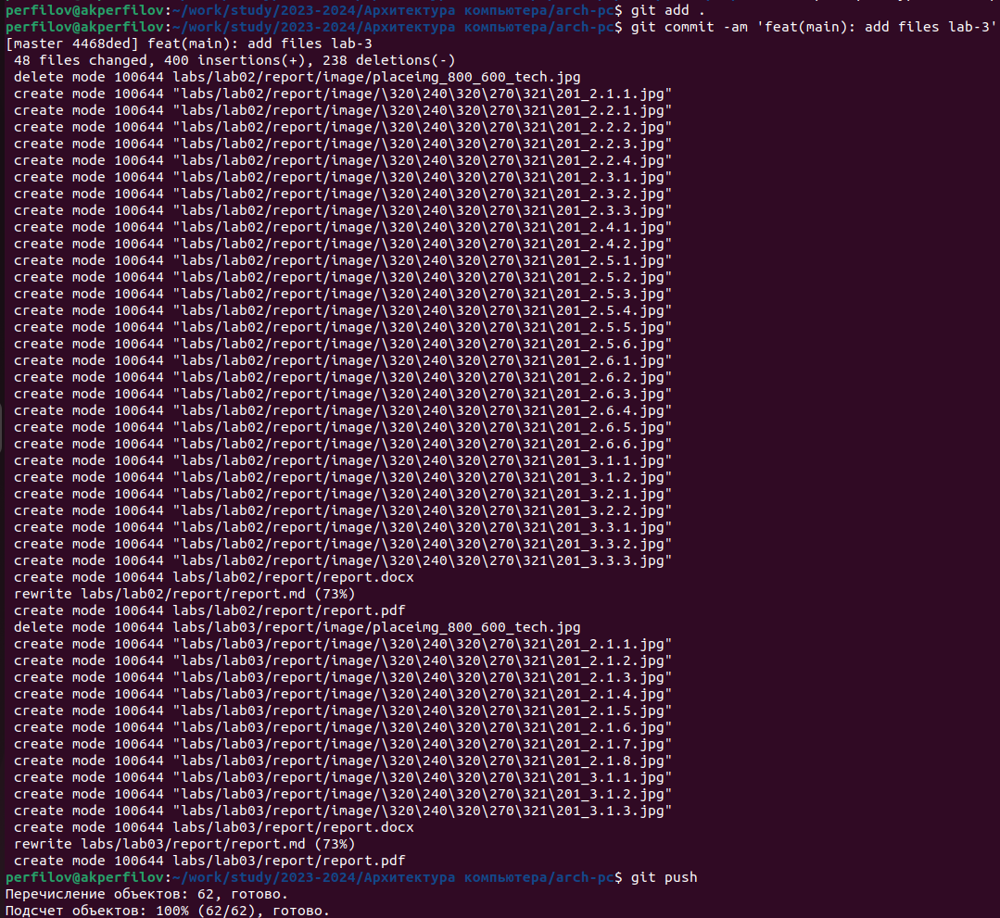{width=100%}

# Самостоятельная работа

**Задание№1 В соответствующем каталоге сделайте отчёт по лабораторной работе № 2 в формате Markdown. В качестве отчёта необходимо предоставить отчёты в 3 форматах: pdf, docx и md**

Перейдём в каталог /lab02/report

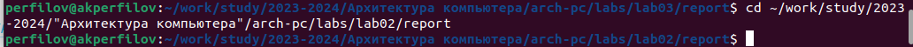{width=100%}

Редактируем файл с помощью текстового редактора

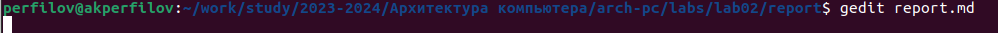{width=100%}

Проведём компиляцию отчета по выполнению лабораторной работы №2 в формате Markdown:

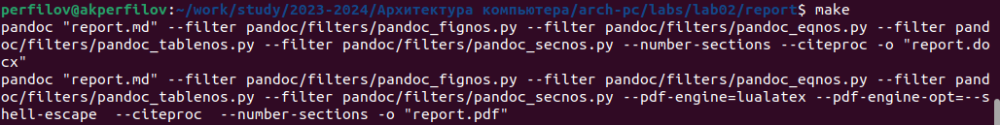{width=100%}

**Задание№2 Загрузите файлы на github.**

Загрузим файлы на github:

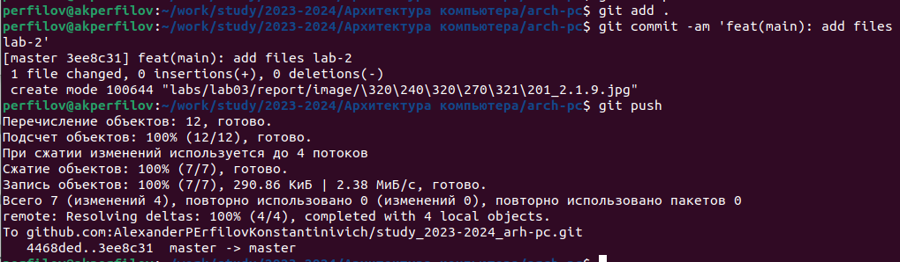{width=100%}

# Вывод

Я освоил процедуры оформления отчетов по лаб. работам с помощью легковесного языка разметки Markdown.

