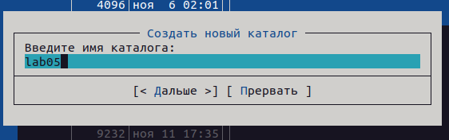
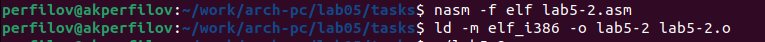

---
## Front matter
title: "Лабораторная работа №5"
subtitle: "Основы работы с Midnight Commander (mc). Структура программы на языке ассемблера NASM. Системные вызовы в ОС
GNU Linux"
author: "Перфилов Александр Константинович | группа: НПИбд 02-23"

## Generic otions
lang: ru-RU
toc-title: "Содержание"

## Bibliography
bibliography: bib/cite.bib
csl: pandoc/csl/gost-r-7-0-5-2008-numeric.csl

## Pdf output format
toc: true # Table of contents
toc-depth: 2
lof: true # List of figures
lot: true # List of tables
fontsize: 12pt
linestretch: 1.5
papersize: a4
documentclass: scrreprt
## I18n polyglossia
polyglossia-lang:
  name: russian
  options:
	- spelling=modern
	- babelshorthands=true
polyglossia-otherlangs:
  name: english
## I18n babel
babel-lang: russian
babel-otherlangs: english
## Fonts
mainfont: PT Serif
romanfont: PT Serif
sansfont: PT Sans
monofont: PT Mono
mainfontoptions: Ligatures=TeX
romanfontoptions: Ligatures=TeX
sansfontoptions: Ligatures=TeX,Scale=MatchLowercase
monofontoptions: Scale=MatchLowercase,Scale=0.9
## Biblatex
biblatex: true
biblio-style: "gost-numeric"
biblatexoptions:
  - parentracker=true
  - backend=biber
  - hyperref=auto
  - language=auto
  - autolang=other*
  - citestyle=gost-numeric
## Pandoc-crossref LaTeX customization
figureTitle: "Рис."
tableTitle: "Таблица"
listingTitle: "Листинг"
lofTitle: "Список иллюстраций"
lotTitle: "Список таблиц"
lolTitle: "Листинги"
## Misc options
indent: true
header-includes:
  - \usepackage{indentfirst}
  - \usepackage{float} # keep figures where there are in the text
  - \floatplacement{figure}{H} # keep figures where there are in the text
---

# Цель работы

Приобретение практических навыков работы в Midnight Commander. Освоение инструкций языка ассемблера mov и int.

# Выполнение лабораторной работы

## Ознакомление с Midnight Commander

Откроем **Midnight Commander**

Перейдем в каталог ~/work/arch-pc созданный при выполнении лабораторной работы №4 

Создадим папку *lab05* с помощью фцнкциональной клавиши *F7* и перейдем в этот каталог

Пользуясь строкой ввода и командой *touch* создадим файл *lab5-1.asm* 

С помощью функциональной клавиши *F4* откройем файл *lab5-1.asm* для редактирования во встроенном редакторе mcedit. 

Введем текст программы из листинга 5.1 (взятый из лаб.№5), сохраним изменения и закройем файл

С помощью функциональной клавиши *F3* откроем файл *lab5-1.asm* для просмотра.
Убедимся, что файл содержит текст программы.

Оттранслируем текст программы lab5-1.asm в объектный файл. Выполним компоновку объектного файла и запустим получившийся исполняемый файл. Программа выводит строку 'Введите строку:' и ожидает ввода с клавиатуры. На запрос введем мое ФИО 'Перфилов Александр Константинович'

## Подключение внешнего файла in_out.asm

Для упрощения написания программ часто встречающиеся одинаковые участки кода (такие как, например, вывод строки на экран или выход их программы) можно оформить в виде подпрограмм и сохранить в отдельные файлы, а во всех нужных местах поставить вызов нужной подпрограммы. Это позволяет сделать основную программу более удобной для написания и чтения.
NASM позволяет подключать внешние файлы с помощью директивы %include, которая предписывает ассемблеру заменить эту директиву содержимым файла. Подключаемые файлы также написаны на языке ассемблера. Важно отметить, что директива %include в тексте программы должна стоять раньше, чем встречаются вызовы подпрограмм из подключаемого файла. Для вызова подпрограммы из внешнего файла используется инструкция call, которая имеет следующий вид

call <function>

где function имя подпрограммы.

Для выполнения лабораторных работ используется файл in_out.asm1, который содержит
следующие подпрограммы [4]:

• slen – вычисление длины строки (используется в подпрограммах печати сообщения для определения количества выводимых байтов);

• sprint – вывод сообщения на экран, перед вызовом sprint в регистр eax необходимо записать выводимое сообщение (mov eax,<message>);

• sprintLF – работает аналогично sprint, но при выводе на экран добавляет к сообщению символ перевода строки;

• sread – ввод сообщения с клавиатуры, перед вызовом sread в регистр eax необходимо записать адрес переменной в которую введенное сообщение буд записано (moveax,<buffer>) , в регистр ebx – длину вводимой строки (mov ebx,<N>);

• iprint – вывод на экран чисел в формате ASCII, перед вызовом iprint в регистр eax необходимо записать выводимое число (mov eax,<int>);

• iprintLF – работает аналогично iprint, но при выводе на экран после числа добавляет к символ перевода строки;

• atoi – функция преобразует ascii-код символа в целое число и записыает результат в регистр eax, перед вызовом atoi в регистр eax необходимо записать число (moveax,<int>);

• quit – завершение программы

Скачаем файл *in_out.asm* со страницы курса в ТУИС.

Подключаемый файл *in_out.asm* должен лежать в том же каталоге, что и файл с программой, в которой он используется.
В одной из панелей mc откройем каталог с файлом *lab5-1.asm*. В другой панели каталог со скаченным файлом *in_out.asm*.

Скопируем файл *in_out.asm* в каталог с файлом *lab5-1.asm* с помощью функциональной клавиши *F5*.

С помощью функциональной клавиши *F6* создадим копию файла *lab5-1.asm* с именем *lab5-2.asm*. Выделим файл lab5-1.asm, нажмем клавишу *F6* , введем имя файла *lab5-2.asm* и нажмем клавишу *Enter*.

Исправим текст программы в файле *lab5-2.asm* с использованием подпрограмм из внешнего файла *in_out.asm* (используем подпрограммы sprintLF, sread и quit) в соответствии с листингом 5.2. Создадим исполняемый файл и проверим его работу

В файле *lab5-2.asm* заменим подпрограмму *sprintLF* на *sprint*. Создадим исполняемый файл и проверим его работу. 

В случае *sprintLF* мы вводим сообщение в след строке, в случае *sprint* воод сообщения происходит в той же строке, где нас просят ввести сообщение после *:*

# Самостоятельная работа

Задание№1 Создайте копию файла lab5-1.asm. Внесите изменения в программу (без использования внешнего файла in_out.asm), так чтобы она работала по следующему алгоритму:

• вывести приглашение типа “Введите строку:”
• ввести строку с клавиатуры
• вывести введённую строку на экран

Для удобства создадим новую папку *tasks* в каталоге *lab05*

Создадим копию файла *lab5-1.asm* в *mc* с помощью *F5*

Изменим программу в mc под условие задачи

Задание №2 Получите исполняемый файл и проверьте его работу. На приглашение ввести строку введите свою фамилию.

Оттранслируем текст программы в объектный файл. Выполним компоновку объектного файла

Проверим работоспособность файла(программы)

*Задание№3 Создайте копию файла lab5-2.asm. Исправьте текст программы с использование подпрограмм из внешнего файла in_out.asm, так чтобы она работала по следующему алгоритму:

• вывести приглашение типа “Введите строку:”
• ввести строку с клавиатуры
• вывести введённую строку на экран

Скопируем файлы *int_out.asm* и *lab5-2.asm* в отдельную папку

Изменим программу в mc под условие задачи

{#fig:001 width=90%}

Задание№4 Создайте исполняемый файл и проверьте его работу.

Оттранслируем текст программы в объектный файл. Выполним компоновку объектного файла

Проверим работоспособность программы

По завершению лаб. работы файлы были загружены на github

# Выводы

Я приобрел практические навыки работы в Midnight Commander и освоил инструкции
языка ассемблера mov и int.

